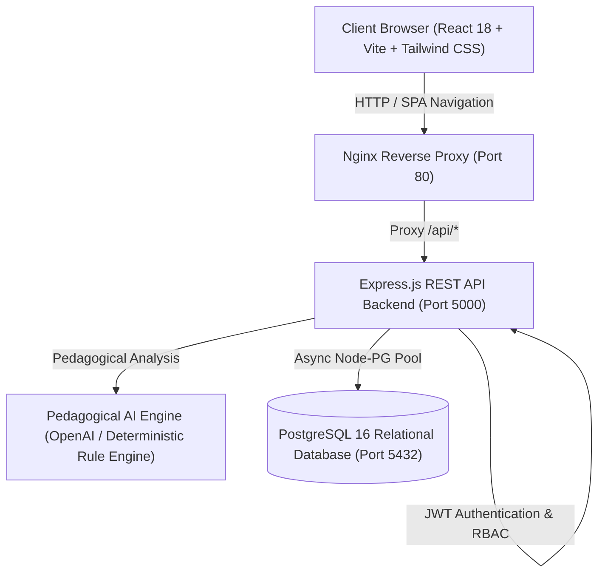
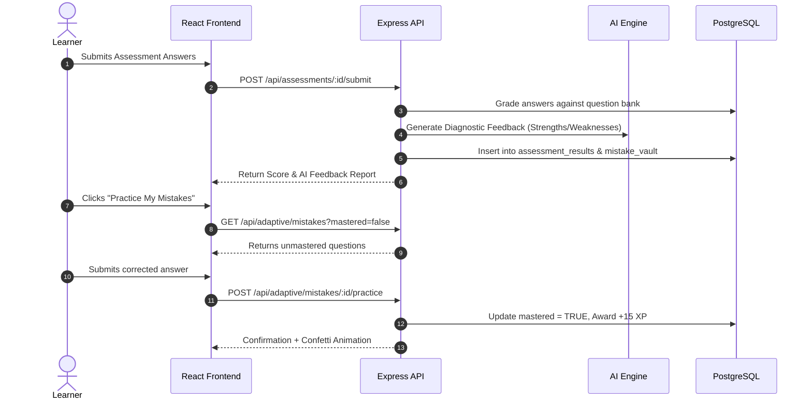

# LinguaLearn — Technical Architecture & System Design

## 1. High-Level System Architecture

LinguaLearn is architected as an intelligent, production-grade 3-tier web application built upon separation of concerns, defensive programming, and stateless REST principles.

---

## 2. Architectural Layers

### Tier 1: Presentation Layer (Frontend)
- **Framework:** React 18 with Vite for lightning-fast HMR and optimized tree-shaken builds.
- **Routing:** React Router v6 with declarative `ProtectedRoute` boundaries enforcing Role-Based Access Control (`learner` vs `admin`).
- **Styling & Theming:** Tailwind CSS combined with a custom 5-palette CSS variable theme engine (`ocean`, `nature`, `bloom`, `midnight`, `sunrise`) supporting Light, Dark, and System appearance modes.
- **Data Visualization:** Recharts rendering dynamic 5-dimension linguistic radar charts and error distribution bar charts.
- **State Management:** React Context API providing decoupled global providers for Authentication, Theme, and Real-Time Toast Notifications.

### Tier 2: Business Logic & Application Layer (Backend)
- **Runtime:** Node.js v20+ with Express.js REST API framework.
- **Security Middleware:** Helmet for security headers, CORS origin whitelisting, Express Rate Limiter (100 req/15 min), and custom JWT bearer verification middleware.
- **Service Layer Pattern:** Clean segregation between HTTP Controllers (request parsing & HTTP status handling) and Business Logic Services (business rules, calculations, and database transactions).
- **Dual-Engine AI Subsystem:** Dynamic orchestrator that interfaces with external LLM APIs when keys are present, seamlessly failing over to a deterministic pedagogical rule engine during offline or development runs.

### Tier 3: Persistence Layer (Database)
- **Engine:** PostgreSQL 16 Alpine.
- **Connection Management:** `node-postgres` (`pg`) connection pooling with parameterized queries preventing SQL injection vulnerabilities.
- **Data Integrity:** Strict foreign key constraints with `ON DELETE CASCADE`, composite uniqueness indices, and timestamp triggers.

---

## 3. Core Component Workflows

### 3.1 Adaptive Mistake Remediation Flow

### 3.2 Role-Based Access Control (RBAC)
- **Learners:** Granted access to course catalogs, lesson viewers, quiz runners, mistake vault, personal progress profiler, and AI chatbot tutor.
- **Administrators:** Granted access to system KPIs, user management, course CRUD, question bank editor, at-risk learner reports, and infrastructure health telemetry.
