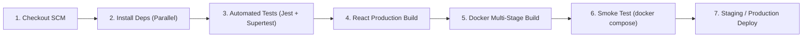

# LinguaLearn — Jenkins CI/CD Automation Pipeline Guide

## 1. Pipeline Architecture

LinguaLearn features an automated Declarative Jenkins CI/CD Pipeline (`Jenkinsfile`) designed around Agile delivery principles:

---

## 2. Pipeline Stages Breakdown

1. **Environment & SCM Checkout:**
   - Prints build metadata (`BUILD_NUMBER`, `GIT_COMMIT`).
   - Verifies runtime tool versions (`node`, `npm`, `docker`, `docker compose`).
2. **Install Dependencies (Parallel):**
   - Executes `npm ci` concurrently across backend and frontend workspaces for deterministic node module installation.
3. **Automated Backend Tests:**
   - Runs unit tests and API integration tests against the database.
   - Generates and publishes `junit.xml` test reports and code coverage metrics.
4. **Frontend Build & Static Analysis:**
   - Runs `npm run build` using Vite.
   - Archives the production bundle artifact (`dist/`).
5. **Docker Image Build (Parallel):**
   - Compiles multi-stage Docker images for `lingualearn-backend` and `lingualearn-frontend`.
   - Tags images with both the unique build number and `latest`.
6. **Smoke Test & Health Check:**
   - Spins up the multi-container stack via `docker compose up -d`.
   - Executes HTTP curl probes against `http://localhost:5000/api/health` and `http://localhost:80/`.
   - Automatically tears down test containers via `docker compose down`.
7. **Blue/Green Deployment:**
   - Deploys container artifacts to the selected target environment (`staging` or `production`).

---

## 3. Jenkins Agent Prerequisites

To execute this pipeline on a Jenkins build node:
- Docker and Docker Compose installed with the `jenkins` user added to the `docker` group.
- Node.js v20+ and npm v10+.
- Jenkins Plugins:
  - *Pipeline* plugin suite
  - *JUnit* plugin for test results reporting
  - *AnsiColor* plugin for terminal color output
